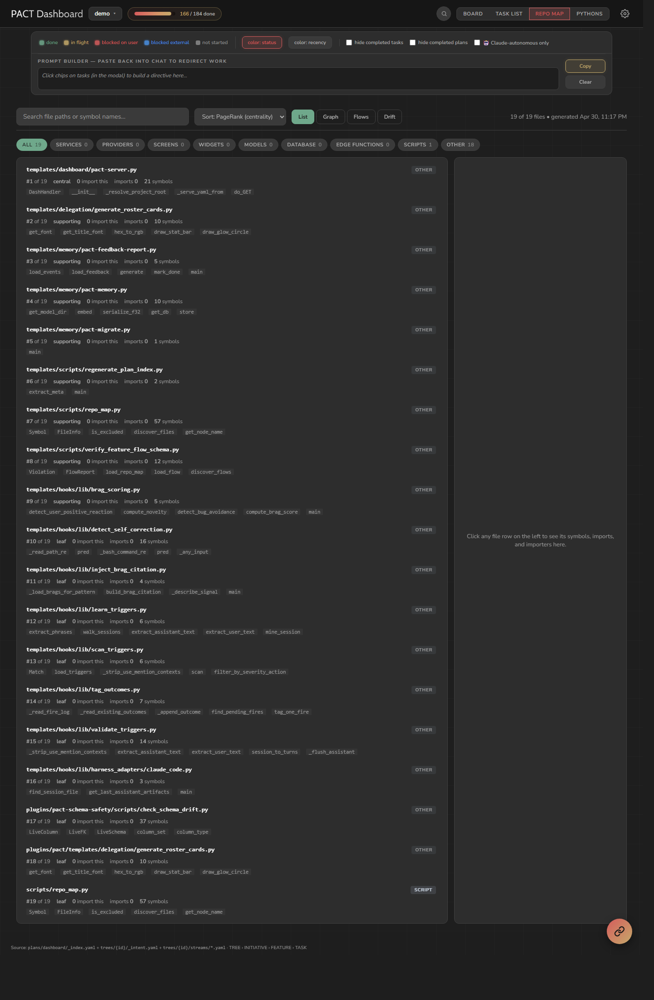
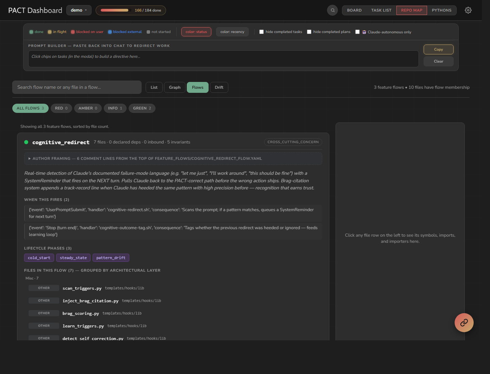
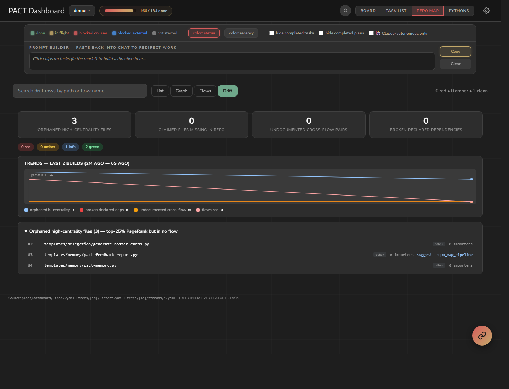

# PACT Dashboard — Real-Time Observability, Task Rating, and Codebase Intent Map

A live dashboard that surfaces what your agent is doing AND what it's working over. Five views, each replacing a class of question that previously required scrolling logs or grep-spawning.

---

## Quick Start

```bash
# Start the dashboard (runs on localhost:7246)
python .claude/hooks/pact-server.py &

# Or set auto-start in config
echo '{"dashboard": "auto"}' > ~/.claude/pact-config.json
```

The `session-register.sh` hook auto-starts the dashboard if configured.

---

## What You See

### Session Lanes
Each active session appears as a horizontal lane with:
- **Avatar** — Claude (tan) or Gemini (blue) with a green pulse dot when active
- **Model identity** and project name
- **Meta chips** — edit count, hook blocks, commits
- **Action buttons** — diagnosis panel, delete session

### Event Timeline
A horizontal scroll of event cards, newest on the right. Each card type has a distinct color and animated icon:

| Event Type | Color | Animation |
|------------|-------|-----------|
| File edit | Blue | Pencil writing |
| Preflight check | Amber | Lightning strike |
| Hook block | Red | Card shake |
| Hook warning | Amber | Gentle pulse |
| Flow read | Cyan | Page turn |
| Governance update | Green | Star twinkle |
| Commit | Purple | Check mark |
| Task rating | Gold | Star burst |

### Pipeline Indicators
Five dots in the header show real-time activity across subsystems: edit, preflight, flow, governance, commits. Each dot lights up (green/amber/red) based on the most recent event in that category.

### Sidebar
- **Scorecard** — Rolling average score (last 10 tasks), current streak, weakest areas by tag
- **Metrics** — Total edits, hook blocks, preflight warnings, commits, active sessions
- **Actions** — Generate feedback report, vector search recall

---

## Task Rating System

Click "Track Next Task" on any session, describe what you're asking the agent to do, and all subsequent events flow into that task's sub-row.

When the task is done, rate it:
- **Score** (1-5)
- **What went wrong** (free text)
- **What went right** (free text)
- **Tags** — UI, Backend, Logic, Missed Requirements, Hallucination, etc.

### How Ratings Feed Back

Ratings are compiled into a **scorecard** at `~/.claude/pact-scorecard.md`:
- Rolling average (last 10 tasks)
- Streak counter (consecutive 4+ ratings)
- Weakest areas by tag (frequency, avg score, examples)
- What's working (tags with consistent high scores)
- Action items (specific improvements based on patterns)

The agent reads this scorecard at session start, creating a direct feedback loop: past ratings shape future behavior.

---

## Diagnosis Panel

Toggle the diagnosis view on any session to see:
- **Hook blocks** — What was blocked and why (red dots)
- **Preflight issues** — Architectural warnings raised (amber dots)
- **Governance staleness** — Docs/maps that weren't updated (amber dots)
- **Coverage** — Which PACT subsystems were exercised during this session

---

## Server API

The dashboard server exposes endpoints for programmatic access:

| Endpoint | Method | Purpose |
|----------|--------|---------|
| `/` | GET | Dashboard HTML |
| `/events?after=N` | GET | Events since index N |
| `/ratings` | GET | All task ratings |
| `/rate` | POST | Submit a task rating |
| `/scorecard` | GET | Current scorecard markdown |
| `/pact-config` | GET/POST | Read/update PACT config |
| `/recall?q=TEXT&top=5` | GET | Vector search via pact-memory |

---

## Data Flow

```
Hooks → pact-event-logger.sh → pact-events.jsonl ← pact-server.py → Dashboard
User → pact-prompt-logger.sh → pact-events.jsonl
User → /rate endpoint → _FEEDBACK.jsonl → pact-server.py → scorecard
Source edits → post-edit-repo-map-dirty.sh → repo_map.json ← dashboard fetch
```

All data is local. Nothing is sent anywhere unless you explicitly choose to share a feedback report.

---

## Repo Map view (Codebase Intent Map)

Aider-style symbol index over your codebase, surfaced as a dashboard view with four sub-tabs.

### List sub-tab

<p align="center">
  
</p>

Searchable, sortable, kind-filtered file list ranked by import-graph PageRank. Each row surfaces the file's symbol count, est-tokens, top symbols, and flow membership. Click any row → side detail panel.

The detail panel pulls from `repo_map.json` and shows:
- **Top symbols** (with leading doc-comment + signature line) — replaces "what does this class do?" grep
- **Imports + importers** — replaces "what depends on this?" grep
- **Flow membership** — which `feature_flows/*.yaml` claim this file
- **Drift schema** (for Drift table files) — columns, types, foreign keys, on-delete rules
- **Edge function metadata** (for `supabase/functions/*/index.ts`) — actions, secrets, buckets, RPCs, external hosts, tables referenced
- **Provider cache shape** (for `lib/providers/*.dart`) — list/map/singleton fields
- **Cross-cutting callers** — if this file is a known hook (AutoPrivacyTagger, etc.), every callsite
- **Anomalies emitted from this file** — `AppAnomalyReporter.report()` callsites
- **Env vars read from this file** — `Deno.env.get`, `String.fromEnvironment`, etc.

### Graph sub-tab

d3-force layout of the top 100 most-central files. Click a node → same detail panel. Useful for spotting hub files at a glance.

### Flows sub-tab

<p align="center">
  
</p>

Card stack of every `feature_flows/*.yaml`. Each card answers WHO / WHAT / WHEN / WHERE / WHY for that flow:

- **Author framing** (collapsible) — top-of-file YAML comments
- **Purpose** + description
- **Triggers** ("when this fires") — what user action / system event / scheduled job kicks the flow off
- **Lifecycle states / phases** — named state objects describing each app state
- **Participating files** — grouped by architectural layer (UI / State / Service / Data / Misc)
- **Declared dependencies** — outbound (depends_on / communicates_with) + inbound (auto-computed from other flows)
- **Invariants** — testable claims that must always be true
- **Diagram** (collapsible Mermaid block, full-screen expand with zoom)
- **References** — pointers to plan_doc / design_manifest / figma / spec / package_knowledge

Search filters across all 4 tabs. Per-flow status filter (red / amber / info / green). Flow status comes from the drift detector.

### Drift sub-tab

<p align="center">
  
</p>

Mechanical drift between flow claims and structural reality:
- **Orphaned high-centrality files** — top-25% PageRank but in no flow's `participating_files`. These are files that probably *should* be claimed but aren't.
- **Claimed files missing in repo** — flow YAML references a path that doesn't exist (refactor surfaced).
- **Undocumented cross-flow imports** — file in flow A imports file in flow B without a `declared_dependencies` entry between them. Either add the declaration or remove the import.
- **Broken declared dependencies** — a flow's `via:` symbol no longer exists in the target's symbol set, or the target flow itself was deleted.

**Sparkline trend chart** — last ~100 builds plotted: orphans, broken_deps, undocumented_pairs, flows_red. Answers "is drift accumulating?" without diffing per-commit.

### Auto-rebuild

The dashboard fetches `plans/dashboard/data/repo_map.json` on load. The `post-edit-repo-map-dirty.sh` PostToolUse hook touches a dirty flag after every Edit/Write to a tracked source file (`lib/*.dart`, `scripts/*.py`, `supabase/functions/*.{ts,tsx,js}`, `feature_flows/*.yaml`). A background builder loops while the dirty flag exists, consuming it before each iteration — so a flurry of edits collapses into a single tail rebuild that captures the final state. ~1-3s end-to-end.

The dashboard always reflects current code state. No manual `python scripts/repo_map.py build` needed.

### History log + sparkline

`plans/dashboard/data/repo_map_history.jsonl` — append-only summary line per build, deduplicated when nothing structural changed. ~250 bytes per line. Drives the Drift tab's sparkline.

Each line:
```json
{"ts": 1761935600, "node_count": 1284, "edge_count": 6366, "flow_count": 38,
 "orphans": 229, "broken_deps": 0, "undocumented_pairs": 286, "flows_red": 0,
 "flows_amber": 30, "schema_version": 48, ...}
```

Forensic queries like "when did `X` first appear in the anomaly catalog?" become single-file `grep` instead of `git log -p` on the 14MB JSON.

### Pre-commit validator

`pre-commit-feature-flow-validator.sh` (PreToolUse Bash hook) runs `scripts/verify_feature_flow_schema.py` before every `git commit`. **BLOCKS** commits with intent-layer errors:
- `missing_purpose` — flow YAML missing top-level `purpose:` field
- `participating_files_path_not_in_repo` — claimed file doesn't exist in `repo_map.json`
- `declared_dep_unknown_target` — `depends_on:` references a non-existent flow
- `declared_dep_via_symbol_not_found` — `via:` symbol not in target's symbol set
- `invariant_anchor_index_out_of_range` — invariant_anchors[].invariant_index is invalid

Warnings are advisory (don't block).

### Porting to other stacks

`templates/scripts/repo_map.py` is project-agnostic at the core (tree-sitter parsing, import graph, PageRank, symbol extraction, class hierarchy, call graph) and project-specific in the EXTRACTORS (drift_schema for Flutter+Drift, edge_functions for Supabase, etc.). Every project-specific extractor checks if its target directory exists and returns `{}` if not — so on a fresh project, the script runs cleanly and just doesn't populate the missing fields.

Full porting guide: [`docs/repo_map_porting.md`](repo_map_porting.md).
